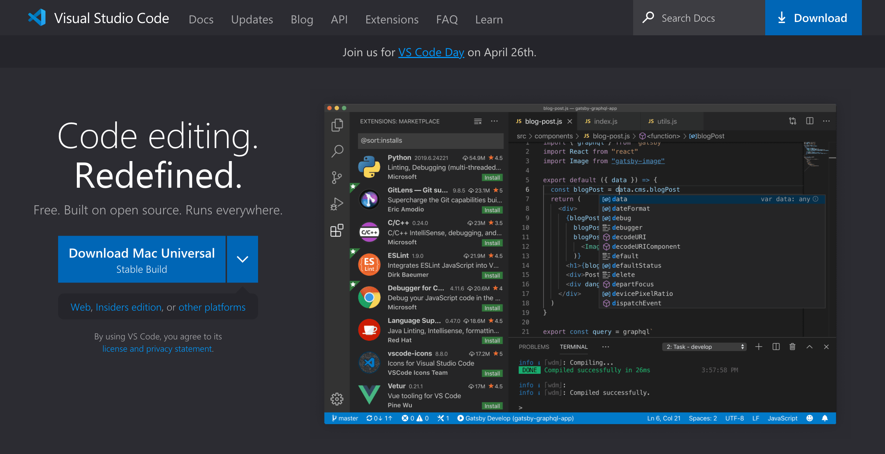
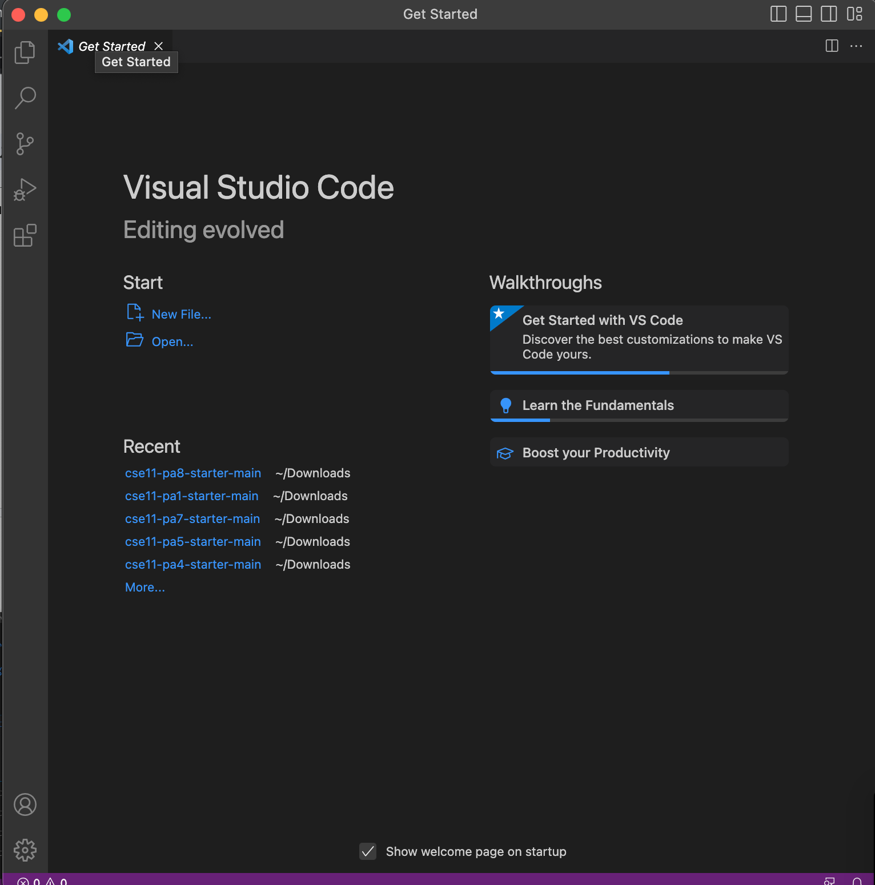
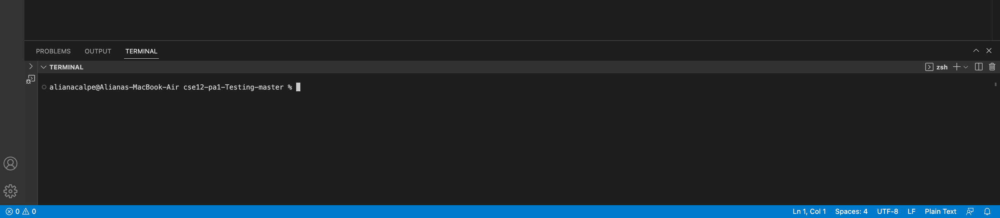
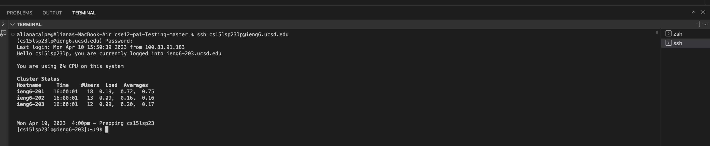

Hey, future 15l students! This is a tutorial on how to log into a course-specific account on ieng6.

# 1. Installing Visual Studio Code

1) Go to the Visual Studio Code website and click on download at the top right of the screen. The website is in this link [VS Code Website](https://code.visualstudio.com/)

2) From the list of operating systems available, download the version for the one you are using. For me, my operating system is mac, so I clicked Download Mac.

3) Once installed, open VS Code and it should look like the picture down below.

# 2. Remotely Connecting

1) For remotely connecting, you will need to open terminal in VS Code, which you can do by pressing Ctrl/Command + '.
   For me, the terminal opened at the bottom of VS Code.
   

2) Then, in ther line of terminal, write "ssh cs15lsp23zz@ieng6.ucsd.edu" with the "zz" replaced with your own specifc account user name for cse 15l.
   You'll be able to find this account name by going to your [UCSD login](https://sdacs.ucsd.edu/~icc/index.php). Login, then you will have to change your password for your cse15l account.
   Make sure to change the passowrd for your cse15l account, whcih starts with cs15sp23, not your actual UCSD account.
   
3) If this is the first time you type in ssh, you will get a message where at the end, they ask "Are you sure you want to continue connecting (yes/no/[fingerprint])?"
   Type yes. It will then ask for the password. Type in your new password for your cse15l account. When typing it in, it may not look like anything is appearing but it is just hiding the password and actually is typing it.
   By the end, it should look similar to this picture.
   

# 3. Trying Some Commands

1) To try commands, type them in the terminal.
   

Here are some commands to try:

cd ~
cd
ls -lat
ls -a

